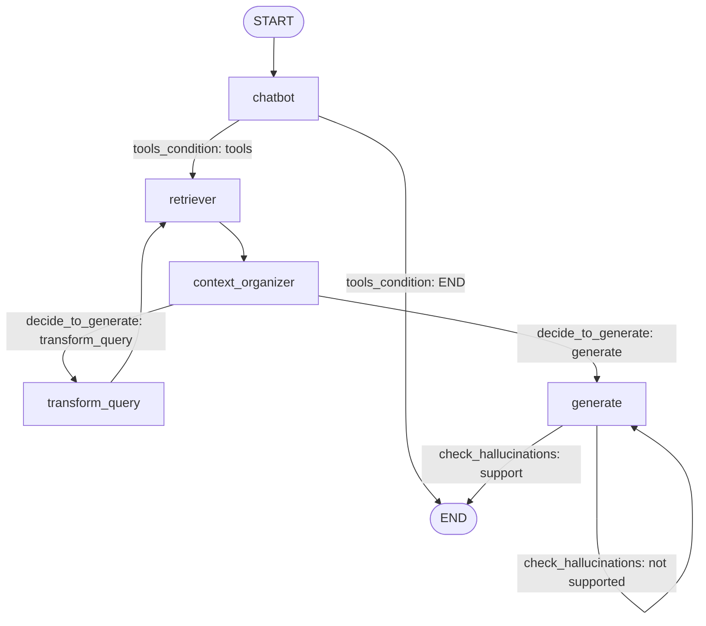

# 2026-10-07 수업 정리: MCP와 LangGraph RAG 에이전트

## 목차

1. [MCP (Model Context Protocol)](#1-mcp-model-context-protocol)
2. [실습 1: 벡터 데이터베이스 구축](#2-실습-1-벡터-데이터베이스-구축)
3. [실습 2: LangGraph RAG 에이전트](#3-실습-2-langgraph-rag-에이전트)
4. [코드 분석: 상태 업데이트와 메시지 처리](#4-코드-분석-상태-업데이트와-메시지-처리)
5. [코드에서 주의할 점](#5-코드에서-주의할-점)

---

## 1. MCP (Model Context Protocol)

### 1.1 개요

- AI 에이전트가 외부 도구와 데이터에 연결되는 방식을 표준화한 오픈 프로토콜이다.
- Anthropic이 2024년 말에 공개했고, 지금은 사실상의 업계 표준이다. 흔히 "AI를 위한 USB-C"에 비유한다.
- LLM은 혼자서는 텍스트만 생성한다. 파일 읽기, DB 조회, 메시지 전송 같은 외부 상호작용이 있어야 에이전트가 된다.
- MCP 이전에는 AI 앱 M개와 도구 N개를 연결하려면 M×N개의 연동이 필요했다. MCP에서는 도구 쪽이 서버를 한 번, 앱 쪽이 클라이언트를 한 번 구현하면 되므로 M+N이 된다.

### 1.2 구조

| 구성 요소 | 역할 |
|---|---|
| 호스트 | 사용자가 쓰는 AI 앱 (Claude 앱, IDE, 직접 만든 에이전트 등) |
| 클라이언트 | 호스트 안에서 서버와 1:1 연결을 맡는 부분 |
| 서버 | 특정 기능을 노출하는 프로그램 (GitHub 서버, Postgres 서버, 사내 시스템 서버 등) |

서버가 제공하는 것은 세 가지다.

| 종류 | 내용 |
|---|---|
| Tools | 모델이 호출하는 함수 (예: `create_issue`, `run_query`). 에이전트에서 가장 핵심이다. |
| Resources | 모델이 읽을 수 있는 데이터 (파일, 문서, 레코드 등) |
| Prompts | 재사용 가능한 프롬프트 템플릿 |

### 1.3 에이전트 루프에서의 동작

1. 에이전트가 시작되면 연결된 MCP 서버들에 어떤 도구가 있는지 묻는다.
2. 도구의 이름, 설명, 입력 스키마가 모델의 컨텍스트에 들어간다.
3. 모델이 작업 중 필요한 도구를 골라 호출을 요청한다.
4. 클라이언트가 요청을 서버에 전달하고, 서버가 실제 작업을 수행한다.
5. 결과가 모델에게 돌아오고, 모델이 다음 행동을 정한다.

### 1.4 프로토콜 내부

MCP는 **JSON-RPC 2.0 메시지를 양방향으로 주고받는 상태 있는 세션**이다. REST처럼 URL마다 리소스가 있는 구조가 아니고, 연결 하나 위에서 `method` 이름으로 서로를 호출한다. 설계는 LSP(Language Server Protocol)에서 영감을 받았다.

**메시지 종류**

| 종류 | 특징 |
|---|---|
| Request | `id`가 있고 응답을 기대한다. |
| Response | 같은 `id`로 `result` 또는 `error`를 돌려준다. |
| Notification | `id`가 없는 단방향 알림이다. |

**세션 흐름**

1) 핸드셰이크: 클라이언트가 `initialize`로 프로토콜 버전과 자신의 capabilities를 알린다. 서버도 자기 capabilities(`tools`, `resources`, `prompts` 중 무엇을 제공하는지)를 응답하고, 클라이언트가 `notifications/initialized`를 보내면 준비가 끝난다. 이후에는 합의된 기능만 쓴다.

```json
{"jsonrpc":"2.0","id":1,"method":"initialize",
 "params":{"protocolVersion":"2025-11-25",
           "capabilities":{"sampling":{}},
           "clientInfo":{"name":"my-agent","version":"1.0"}}}
```

2) 도구 발견: 클라이언트가 `tools/list`를 호출하면 서버가 도구 목록을 돌려준다.

```json
{"jsonrpc":"2.0","id":2,"result":{"tools":[
  {"name":"get_weather",
   "description":"도시의 현재 날씨 조회",
   "inputSchema":{"type":"object",
                  "properties":{"city":{"type":"string"}},
                  "required":["city"]}}]}}
```

`description`과 `inputSchema`(JSON Schema)는 그대로 모델에게 전달된다. 모델이 도구를 언제 어떻게 쓸지 판단하는 유일한 근거이므로, 설명 품질이 에이전트 성능에 직접 영향을 준다.

3) 도구 호출: 모델이 호출을 결정하면 클라이언트가 `tools/call`을 보낸다.

```json
{"jsonrpc":"2.0","id":3,"method":"tools/call",
 "params":{"name":"get_weather","arguments":{"city":"Seoul"}}}
```

```json
{"jsonrpc":"2.0","id":3,
 "result":{"content":[{"type":"text","text":"맑음, 18°C"}],
           "isError":false}}
```

- 결과는 텍스트, 이미지 등의 `content` 블록 배열이다.
- 도구 실행 실패는 프로토콜 에러가 아니라 `isError: true`로 표현한다. 모델이 실패 내용을 읽고 스스로 대처할 수 있게 하기 위해서다.
- `resources/list`, `resources/read`, `prompts/get` 등 다른 기능도 같은 패턴이다.

**양방향성 (서버 → 클라이언트)**

| 메서드 | 내용 |
|---|---|
| `notifications/tools/list_changed` | 도구 목록이 바뀌었으니 다시 조회하라는 알림 |
| `sampling/createMessage` | 서버가 호스트의 LLM에게 추론을 부탁한다. 서버가 자체 API 키 없이 모델을 쓸 수 있다. |
| `elicitation/create` | 서버가 사용자에게 추가 입력을 요청한다. |
| 진행 상황, 로그, 취소 알림 | 오래 걸리는 작업을 위한 것 |

**전송 계층**: 메시지 형식은 같고 실어 나르는 방법만 다르다.

| 방식 | 동작 | 용도 |
|---|---|---|
| stdio | 호스트가 서버를 자식 프로세스로 띄우고 stdin/stdout으로 JSON을 한 줄씩 주고받는다. | 로컬 서버 |
| Streamable HTTP | 클라이언트가 단일 엔드포인트에 POST로 메시지를 보내고, 서버는 일반 JSON 응답이나 SSE 스트림으로 답한다. 인증은 OAuth 2.1 기반이다. | 원격 서버 |

### 1.5 Tool calling과 MCP의 관계

둘은 서로 다른 구간을 담당하고, 실제로는 이어 붙여서 쓴다.

```
모델  ←— tool calling —→  에이전트 앱(호스트)  ←— MCP —→  도구 서버
```

- **Tool calling**: 모델의 능력이자 LLM API의 기능이다. 앱이 도구 정의(이름, 설명, 스키마)를 요청에 넣어 보내면, 모델이 "이 도구를 이 인자로 호출하겠다"는 구조화된 출력을 낸다. 모델은 의사만 표현하고, 실제 실행은 앱이 한다.
- **MCP**: 앱이 도구 정의를 어디서 가져오고 실행을 누구에게 맡길지를 표준화한다.

한 번의 호출에서 맞물리는 순서는 다음과 같다.

1. 앱이 MCP 서버에서 `tools/list`로 도구 목록을 받는다.
2. 앱이 이를 LLM API의 도구 정의 형식으로 변환해 요청에 넣는다. 필드 구조가 거의 같아서 단순한 매핑이다.
3. 모델이 tool calling으로 `get_weather(city="Seoul")` 호출을 출력한다.
4. 앱이 이를 MCP `tools/call` 메시지로 바꿔 서버에 보낸다.
5. 앱이 서버 결과를 tool result로 모델에게 되돌려준다.

모델은 MCP의 존재를 모른다. 도구가 MCP 서버에서 왔든 앱에 하드코딩된 함수든 똑같은 도구 정의로 보인다.

**MCP 없이 tool calling만 써도 되는 경우**: 도구가 몇 개뿐이고 그 앱에서만 쓴다면, 도구 정의와 실행 함수를 앱 코드에 직접 작성하는 편이 더 단순하다.

**MCP가 더하는 것** (도구를 앱에서 분리)

| 항목 | 내용 |
|---|---|
| 재사용 | MCP 서버 하나를 여러 에이전트 앱이 그대로 쓴다. |
| 모델 중립 | LLM 제공사마다 tool calling 형식이 달라도 도구 쪽은 영향받지 않는다. |
| 런타임 확장 | 코드 수정 없이 서버를 추가하면 에이전트 능력이 늘어난다. |
| 도구 외 기능 | 리소스, 프롬프트, 인증, 진행 알림까지 규격에 포함된다. |

### 1.6 기존 RPC(REST, gRPC)와 다른 점

기술적으로는 그냥 JSON-RPC다. 차이는 **호출하는 주체가 프로그래머가 아니라 모델**이라는 전제에서 나온다.

| 차이 | 설명 |
|---|---|
| 호출 코드를 미리 작성하지 않는다 | 모델이 런타임에 도구 설명을 읽고 쓸지 말지와 인자를 정한다. 그래서 자기 기술(이름, 자연어 설명, 스키마)과 도구 발견(`tools/list`)이 프로토콜의 중심이다. OpenAPI는 사람과 코드 생성기를 위한 문서이고, MCP의 설명은 모델의 컨텍스트에 들어갈 것을 전제로 한다. |
| 연결이 런타임에 결정된다 | 앱은 빌드 시점에 어떤 도구가 붙을지 모른다. 플러그인 시스템에 가깝다. |
| 결과 형식이 모델에 맞춰져 있다 | 반환값은 타입이 정해진 구조체가 아니라 모델이 읽을 텍스트나 이미지 블록이다. 실패도 예외가 아니라 모델이 읽을 내용으로 돌려준다. |
| 역방향 흐름이 규격에 있다 | sampling, elicitation, 목록 변경 알림 등 일반 요청-응답 API에 없는 개념이 들어 있다. |

**각광받는 이유**는 설계보다 네트워크 효과에 있다.

- 통합 비용: 에이전트의 쓸모는 연결된 도구 수에 비례한다. 표준이 있으면 서비스 회사는 MCP 서버를 한 번만 만들면 된다.
- 타이밍: tool calling이 실용 수준이 된 시점에 연결 표준이 비어 있었고, MCP가 오픈 규격과 SDK를 들고 먼저 나왔다.
- 중립성: 특정 모델에 묶이지 않아 경쟁사들도 채택했다. 서버가 많아 클라이언트가 지원하고, 클라이언트가 많아 서버가 만들어지는 순환이 생겼다.

**한계**

- 보안: 서버가 반환한 내용에 악의적 지시가 섞일 수 있다(프롬프트 인젝션). 신뢰할 수 없는 서버는 위험하므로 권한 범위와 사용자 승인 절차가 중요하다.
- 컨텍스트 비용: 서버를 많이 붙이면 도구 설명만으로 컨텍스트가 크게 소모된다. 그래서 필요한 도구만 그때그때 불러오는 방식이 함께 쓰인다.
- 과대평가 논란: 모델이 코드를 잘 쓰게 되면서, 기존 CLI나 API를 코드로 직접 호출하게 하는 편이 더 유연하고 컨텍스트도 덜 쓴다는 주장이 있다.

### 1.7 도구 실행 위치: 클라이언트 실행과 서버 실행

| 방식 | 동작 |
|---|---|
| 클라이언트 실행 (기본) | 모델이 도구 호출을 출력하면 API 응답이 거기서 끝난다. 클라이언트가 도구를 실행하고 결과를 담아 다시 요청한다. 도구 한 번에 API 왕복이 한 번씩 생긴다. |
| 서버 실행 | LLM 제공사의 인프라가 도구를 직접 실행하고 결과를 모델에 넣어 추론을 이어간다. 클라이언트는 요청을 한 번 보내고 최종 응답만 받는다. |

서버 실행에는 두 형태가 있다.

1. **제공사 내장 도구**: 웹 검색, 코드 실행처럼 제공사가 직접 운영하는 도구. 요청에서 켜기만 하면 된다.
2. **원격 MCP 서버 직접 연결**: API 요청에 MCP 서버 URL을 적어 보내면 제공사 서버가 MCP 클라이언트 역할을 대신한다. Anthropic API에서는 MCP connector라는 베타 기능이다.

```python
response = client.beta.messages.create(
    model="claude-opus-5-5",
    max_tokens=1000,
    messages=[{"role": "user", "content": "열려 있는 버그 찾아줘"}],
    mcp_servers=[{"type": "url",
                  "url": "https://mcp.example.com/mcp",
                  "name": "issue-tracker",
                  "authorization_token": "TOKEN"}],
    tools=[{"type": "mcp_toolset", "mcp_server_name": "issue-tracker"}],
    betas=["mcp-client-2025-11-20"],
)
```

응답에는 호출 내역과 결과가 `mcp_tool_use`, `mcp_tool_result` 블록으로 함께 들어온다.

**제약**

| 제약 | 내용 |
|---|---|
| 공개 서버만 가능 | 서버가 HTTP로 공개되어 있어야 한다. 로컬 stdio 서버, 내 PC 파일, 사내망 시스템은 클라이언트 쪽에서 실행해야 한다. |
| 도구 호출만 지원 | 리소스와 프롬프트는 쓸 수 없다. |
| 인증은 직접 처리 | OAuth 흐름으로 액세스 토큰을 미리 받아 두고 갱신도 해야 한다. |
| 통제권 감소 | 호출 사이에 끼어들 수 없어서 실행 전 사용자 승인이나 인자 검증을 넣기 어렵다. 위험한 도구는 요청 단계에서 꺼 둔다. |

공개된 원격 서비스의 도구를 간단히 붙일 때는 서버 실행이 편하고, 로컬 자원 접근이나 실행 전 승인이 필요하면 클라이언트 실행이 맞다. 실제 에이전트는 둘을 섞어 쓰는 경우가 많다.

참고: [MCP connector - Claude Platform Docs](https://platform.claude.com/docs/en/agents-and-tools/mcp-connector)

---

## 2. 실습 1: 벡터 데이터베이스 구축

`vector_retriever.ipynb` (6.5.2 벡터 데이터베이스의 이해와 사용하기). PDF를 읽어 청크로 나누고, 임베딩해서 Chroma에 저장한다.

### 2.1 PDF 로드

```python
from langchain_community.document_loaders import PyPDFLoader

file_path = "datasets/한글맞춤법 표준어규정 해설.pdf"
loader = PyPDFLoader(file_path)
pages = []

async for page in loader.alazy_load():
    pages.append(page)
```

- 결과는 264페이지이고, 페이지 하나가 `Document` 하나다.
- 각 `Document`는 `page_content`와 `metadata`를 가진다. `metadata['page']`는 0부터 시작하는 페이지 번호이고, `page_label`은 1부터 시작한다.

### 2.2 청크 분할

```python
from langchain_text_splitters import RecursiveCharacterTextSplitter

text_splitter = RecursiveCharacterTextSplitter(chunk_size=500, chunk_overlap=50)
docs = text_splitter.split_documents(pages)
```

- 최대 500자, 겹침 50자로 나누어 510개의 청크가 만들어졌다.
- 청크는 원본 페이지의 메타데이터를 그대로 물려받는다. 그래서 나중에 답변에 출처 페이지를 표시할 수 있다.

### 2.3 임베딩과 저장

```python
from langchain_chroma import Chroma
from langchain_openai import OpenAIEmbeddings

DB_PATH = "./chroma_db"

vectorstore = Chroma.from_documents(
    documents=docs,
    embedding=OpenAIEmbeddings(model="text-embedding-3-small"),
    persist_directory=DB_PATH,
    collection_name="korean_pdf"
)
```

- `persist_directory`를 지정하면 디스크에 저장되어, 다음부터는 임베딩을 다시 하지 않고 불러와 쓸 수 있다.
- 검색 확인: `vectorstore.similarity_search("구개음화", k=3)`은 질의와 가장 유사한 청크 3개를 돌려준다.

### 2.4 Retriever와 도구 만들기 (`retriever.py`)

```python
DB_PATH = "./rag_agent/chroma_db"

vectorstore = Chroma(
    persist_directory=DB_PATH,
    embedding_function=OpenAIEmbeddings(model="text-embedding-3-small"),
    collection_name="korean_pdf",
)

retriever = vectorstore.as_retriever(search_kwargs={"k": 3})

retriever_tool = create_retriever_tool(
    retriever,
    name="pdf_search",
    description="use this tool to search information from the Korean Spelling Rules PDF document",
)
```

- 저장된 DB를 불러올 때는 저장할 때와 **같은 임베딩 모델과 같은 `collection_name`** 을 써야 한다.
- `as_retriever(search_kwargs={"k": 3})`: 상위 3개 문서를 돌려주는 retriever로 바꾼다.
- `create_retriever_tool`: retriever를 LLM이 호출할 수 있는 도구로 감싼다. `description`은 LLM이 이 도구를 쓸지 판단하는 근거다.

---

## 3. 실습 2: LangGraph RAG 에이전트

검색 결과를 평가하고, 부족하면 질문을 고쳐 다시 검색하고, 답변의 환각 여부까지 검사하는 RAG 그래프다.

### 3.1 파일 구성

| 파일 | 내용 |
|---|---|
| `state.py` | 그래프 공유 상태 `AgentState` |
| `retriever.py` | 벡터 DB 로드, retriever, retriever 도구 |
| `nodes.py` | 노드 함수 5개 |
| `edges.py` | 조건부 엣지 함수 2개 |
| `agent.py` | 그래프 조립과 실행 |

### 3.2 상태 (`state.py`)

```python
from langgraph.graph import MessagesState

class AgentState(MessagesState):   # messages: Annotated[list, add_messages]
    question: str
    context: str
    answer: str
    retry_num: int
```

| 키 | 업데이트 방식 | 용도 |
|---|---|---|
| `messages` | 뒤에 추가 (`add_messages` 리듀서) | 실행 과정 기록, 스트리밍 출력 |
| `question` | 덮어쓰기 | 검색, 평가, 답변 생성에 쓰는 현재 질문 |
| `context` | 덮어쓰기 | 검색된 문서 내용 |
| `answer` | 덮어쓰기 | 생성된 답변 |
| `retry_num` | 덮어쓰기 | 질문 재작성 횟수 |

### 3.3 그래프 구조 (`agent.py`)



```python
graph_builder = StateGraph(AgentState, input_schema=MessagesState)
graph_builder.add_node("chatbot", chatbot)
graph_builder.add_node("retriever", retrieve)

graph_builder.add_edge(START, "chatbot")
graph_builder.add_conditional_edges(
    "chatbot",
    tools_condition,
    {"tools": "retriever", END: END},
)

graph_builder.add_node("context_organizer", context_organizer)
graph_builder.add_node("transform_query", transform_query)
graph_builder.add_node("generate", generate)

graph_builder.add_edge("retriever", "context_organizer")
graph_builder.add_conditional_edges(
    "context_organizer",
    decide_to_generate,
    {"transform_query": "transform_query", "generate": "generate"},
)
graph_builder.add_edge("transform_query", "retriever")
graph_builder.add_conditional_edges(
    "generate",
    check_hallucinations,
    {"not supported": "generate", "support": END},
)

graph = graph_builder.compile()
```

- `StateGraph(AgentState, input_schema=MessagesState)`: 내부 상태는 `AgentState`이지만, 외부에서 넣는 입력은 `messages`만 받는다.
- `add_conditional_edges(출발 노드, 라우팅 함수, 매핑)`: 라우팅 함수가 돌려준 문자열을 매핑에서 찾아 다음 노드를 정한다.
- `tools_condition`: LangGraph 내장 라우터다. 마지막 메시지에 `tool_calls`가 있으면 `"tools"`를, 없으면 `END`를 돌려준다. 여기서는 `"tools"`를 `"retriever"` 노드에 연결했다.
- `graph.get_graph().draw_mermaid_png()`: 그래프 구조를 PNG로 저장한다.

**실행**

```python
response = graph.stream({"messages": ["구개음화가 뭐야?"]})

for chunk in response:
    for node, value in chunk.items():
        if node:
            print("---", node, "---")
        if "messages" in value:
            print(value['messages'][0].content)
    print("="*60)
```

- `graph.stream()`은 노드 하나가 끝날 때마다 `{노드 이름: 그 노드가 반환한 업데이트}`를 내보낸다.
- `messages`에 문자열을 넣으면 `add_messages`가 `HumanMessage`로 바꾼다.

### 3.4 노드 (`nodes.py`)

공통: `llm = ChatOpenAI(model="gpt-4o")`, 체인은 `프롬프트 | llm` 형태(LCEL)로 만든다.

| 노드 | 읽는 상태 | 하는 일 | 반환하는 업데이트 |
|---|---|---|---|
| `chatbot` | `messages` | 도구를 바인딩한 LLM을 호출한다. LLM이 검색할지 바로 답할지 정한다. | `messages`, `question` |
| `retrieve` | `question`, `messages[-1]` | 벡터 DB를 검색하고 결과를 `Page N: 내용` 형태의 문자열로 합친다. | `messages`, `context` |
| `context_organizer` | `context` | LLM으로 검색 결과의 공백과 정렬을 정리한다. 페이지 번호는 유지한다. | `context`, `messages` |
| `transform_query` | `question`, `retry_num` | LLM으로 질문을 벡터 검색에 맞게 다시 쓴다. | `question`, `messages`, `retry_num` |
| `generate` | `question`, `context`, `retry_num` | 질문과 context로 답변을 만든다. | `question`, `answer`, `messages` |

**chatbot**

```python
def chatbot(state: AgentState):
    messages = state["messages"]
    llm_with_tools = llm.bind_tools([retriever_tool])
    response = llm_with_tools.invoke(messages)

    return {
        "messages": [response],
        "question": messages[-1].content
    }
```

`bind_tools`는 도구 정의를 LLM 요청에 붙인다. LLM이 도구를 쓰기로 하면 응답 `AIMessage`의 `tool_calls`에 호출 정보가 들어간다.

**retrieve**

```python
def retrieve(state: AgentState):
    question = state["question"]
    relevant_doc = retriever.invoke(question)
    context = ""
    for doc in relevant_doc:
        context += f"Page {doc.metadata['page']+1}: {doc.page_content}\n"

    last_message = state["messages"][-1]

    if hasattr(last_message, 'tool_calls') and len(last_message.tool_calls) > 0:
        tool_call_id = last_message.tool_calls[0]['id']
        tool_message = ToolMessage(
            content=context,
            name="retriever",
            tool_call_id=tool_call_id
        )
        return {"messages": [tool_message], "context": context}
    else:
        return {"messages": [context], "context": context}
```

`metadata['page']`가 0부터 시작하므로 1을 더해 실제 페이지 번호로 만든다.

**transform_query**

```python
better_question = question_rewriter.invoke({"question": question})
return {
    "question": better_question.content,
    "messages": [better_question],
    "retry_num": state["retry_num"] + 1 if state.get("retry_num") else 1,
}
```

`retry_num`은 처음에 상태에 없으므로 `state.get()`으로 확인하고, 없으면 1로 시작한다.

**generate**: `retry_num`에 따라 프롬프트가 달라진다.

| 조건 | 프롬프트 |
|---|---|
| `retry_num < 3` | 검색된 context로 질문에 답한다. 모르면 모른다고 말하고, 출처 페이지 번호를 반드시 밝힌다. |
| `retry_num >= 3` | 검색이 충분하지 않은 상황이다. 답하지 못한 것에 양해를 구하고, 검색 결과로 답할 수 있는 다른 질문을 제안한다. |

### 3.5 조건부 엣지 (`edges.py`)

둘 다 `with_structured_output`으로 LLM 출력을 Pydantic 모델에 맞춰 받는다. 문자열을 파싱할 필요 없이 `score.binary_score`로 값을 바로 꺼낸다.

```python
class Grade(BaseModel):
    """관련성 확인을 위한 점수 스키마"""
    binary_score: str = Field(description="문서가 질문과 관련이 있는지 여부, 'yes' 또는 'no'")

grader = llm.with_structured_output(Grade)
chain = grader_prompt | grader
score = chain.invoke({"question": question, "context": context})
grade = score.binary_score
```

**decide_to_generate** (검색 문서 관련성 평가)

| 순서 | 조건 | 반환값 |
|---|---|---|
| 1 | `retry_num >= 3` | `"generate"` (LLM 평가 없이 바로) |
| 2 | `context`나 `question`이 비어 있음 | `"generate"` |
| 3 | 평가 결과 `"no"` | `"transform_query"` |
| 4 | 그 외 | `"generate"` |

평가 프롬프트는 엄격한 테스트가 아니라 잘못된 검색 결과를 걸러내는 것이 목표라고 명시한다. 문서에 질문과 관련된 키워드나 의미가 있으면 관련 있다고 본다.

**check_hallucinations** (답변 근거 검증)

| 평가 결과 | 반환값 | 다음 |
|---|---|---|
| `"yes"` (답변이 context에 근거함) | `"support"` | `END` |
| 그 외 | `"not supported"` | `generate` 재실행 |

### 3.6 실행 흐름 예시

입력이 `"구개음화가 뭐야?"`일 때 정상 경로는 다음과 같다.

1. `chatbot`: LLM이 `pdf_search` 도구 호출을 출력한다. `question`에 원래 질문을 저장한다.
2. `tools_condition`: `tool_calls`가 있으므로 `retriever`로 간다.
3. `retriever`: `question`으로 검색해 `context`를 채운다.
4. `context_organizer`: `context`를 정리한다.
5. `decide_to_generate`: 관련 있으면 `generate`로, 없으면 `transform_query` → `retriever`로 돌아간다(최대 3회).
6. `generate`: 답변을 만든다.
7. `check_hallucinations`: 근거가 있으면 종료하고, 없으면 `generate`를 다시 실행한다.

---

## 4. 코드 분석: 상태 업데이트와 메시지 처리

### 4.1 노드의 `return`은 상태 업데이트다

노드 함수의 `return`은 호출한 쪽에 값을 돌려주는 일반적인 반환이 아니다. **LangGraph에게 공유 상태를 이렇게 바꿔 달라고 요청하는 업데이트 내용**이다. LangGraph가 반환된 dict를 `AgentState`에 반영하고, 다음 노드는 바뀐 상태를 `state`로 받는다.

| 반환 키 | 반영 방식 | 이유 |
|---|---|---|
| `"messages": [response]` | 기존 리스트 뒤에 추가 | `MessagesState`의 `add_messages` 리듀서 |
| `"question": ...` | 기존 값을 덮어씀 | 리듀서가 없는 일반 필드 |
| 반환하지 않은 키 | 그대로 유지 | 반환한 키만 바뀜 |

그래서 `"messages": [response]`처럼 리스트로 감싸 반환하면 메시지가 하나씩 누적된다.

### 4.2 `chatbot`의 `messages[-1].content`

`messages = state["messages"]`는 노드가 실행되기 **전**의 메시지 목록이다. `chatbot`은 `START` 바로 다음 노드이므로 마지막 메시지는 사용자 입력이다.

```
chatbot 실행 전 state
  messages = [HumanMessage("구개음화가 뭐야?")]
  question = (없음)

chatbot 실행 후 state
  messages = [HumanMessage("구개음화가 뭐야?"),
              AIMessage(tool_calls=[검색 도구 호출])]   ← response 추가
  question = "구개음화가 뭐야?"                          ← 사용자 질문을 따로 저장
```

`chatbot`이 반환한 값은 다음 곳에서 쓰인다.

- `messages`에 추가된 `response`
  - `tools_condition`이 `state["messages"][-1]`을 확인해 `retriever`로 갈지 `END`로 갈지 정한다.
  - `retrieve` 노드가 여기서 `tool_calls[0]['id']`를 꺼내 `ToolMessage`를 만든다.
- `question`
  - `retrieve`: `retriever.invoke(question)`으로 검색한다.
  - `decide_to_generate`: 문서 관련성을 평가한다.
  - `transform_query`: 질문을 고쳐 `question`을 덮어쓴다.
  - `generate`: 최종 답변을 만든다.
  - `check_hallucinations`: 답변이 근거에 맞는지 검증한다.

### 4.3 `question`과 `messages`를 따로 두는 이유

`question`은 지금 처리 중인 질문 하나를 담는 값이고, `messages`는 지금까지 무슨 일이 있었는지를 쌓는 기록이다.

- `messages`만 반환하면 이후 노드들이 개선된 질문을 쓰지 못한다.
- `question`만 반환하면 대화 기록에 변환 과정이 남지 않고, 스트리밍 출력에도 보이지 않는다.
- `messages[-1].content`에서 질문을 꺼내는 방식은 쓸 수 없다. 사이에 `ToolMessage`나 `AIMessage`(문서 정리 결과 등)가 끼어들어 마지막 메시지가 질문이라는 보장이 없다.
- 그래서 질문은 전용 키에 문자열로 둔다. `better_question.content`처럼 `.content`만 꺼내 저장하는 이유도 이것이다.

같은 내용이 두 곳에 들어가 중복처럼 보이지만 LangGraph에서 흔한 패턴이다. 작업용 값은 전용 키에 두고, 기록과 표시용 내용은 `messages`에 쌓는다.

### 4.4 `retrieve`의 if 분기: 진입 경로가 둘이다

```
chatbot ──(tools_condition: "tools")──► retriever     ← 경로 ①
transform_query ──────────────────────► retriever     ← 경로 ②
```

어느 경로로 왔는지는 `state["messages"][-1]`, 즉 바로 앞 노드가 남긴 메시지로 구분한다.

| | 경로 ① `chatbot`에서 옴 | 경로 ② `transform_query`에서 옴 |
|---|---|---|
| 마지막 메시지 | `tool_calls`가 들어 있는 `AIMessage` | `tool_calls`가 `[]`인 일반 `AIMessage` |
| 분기 | `if` | `else` |
| `messages`에 넣는 것 | `ToolMessage(content=context, tool_call_id=...)` | 문자열 `context` |
| `context` | 같음 | 같음 |

**경로 ①에서 `ToolMessage`를 만드는 이유**: OpenAI API 규칙상 `tool_calls`를 가진 `AIMessage` 다음에는 같은 `tool_call_id`를 가진 `ToolMessage`가 반드시 와야 한다. 짝이 없는 메시지 기록을 나중에 LLM에 다시 넣으면 400 에러가 난다(체크포인터나 Studio에서 대화를 이어갈 때 등).

**경로 ②에서 문자열을 넣는 이유**: 응답할 도구 호출이 없어 `tool_call_id`가 없으므로 `ToolMessage`를 만들 수 없다. `add_messages`는 일반 문자열을 `HumanMessage`로 변환하므로, 검색 결과가 사용자 메시지처럼 기록된다. 동작에는 문제가 없지만 의미상 어색하다. `AIMessage(context)`로 넣는 편이 더 정확하다.

**조건식을 두 개 쓰는 이유**

```python
hasattr(last_message, 'tool_calls') and len(last_message.tool_calls) > 0
```

- `hasattr(...)`: `HumanMessage`처럼 `tool_calls` 속성이 없는 메시지를 걸러낸다.
- `len(...) > 0`: `AIMessage`는 항상 `tool_calls` 속성을 갖고 있으므로, 실제로 호출이 들어 있는지 확인해야 한다. 경로 ②의 `better_question`이 여기서 걸러진다.

다음 노드 `context_organizer`는 `messages`가 아니라 `state["context"]`만 읽는다. 따라서 이 분기는 **메시지 기록의 형식**만 다르게 할 뿐, 이후 RAG 흐름에는 영향이 없다.

---

## 5. 코드에서 주의할 점

수업 필기에 나온 것

- **LLM이 만든 검색어는 쓰이지 않는다.** `retrieve`는 도구 호출 인자(`tool_calls[0]['args']`)가 아니라 `state["question"]`으로 검색한다. 원래 질문이나 재작성된 질문이 쓰인다.
- **`tool_calls[0]`만 처리한다.** LLM이 도구를 한 번에 여러 개 호출하면 나머지 호출에는 `ToolMessage`가 붙지 않아 짝 규칙이 깨진다. 이 예제는 도구가 하나뿐이라 거의 문제가 되지 않는다.
- **`retry_num`으로 재검색 루프를 막는다.** `transform_query`가 3번 실행되면 `decide_to_generate`가 평가 없이 `generate`로 보내고, `generate`는 대체 질문을 안내하는 프롬프트를 쓴다.

코드를 읽으며 추가로 확인한 것 (실행해서 검증하지는 않음)

- **`generate` 루프에는 횟수 제한이 없다.** `check_hallucinations`가 계속 `"not supported"`를 돌려주면 `generate`가 반복된다. `retry_num`은 `transform_query`에서만 늘어나므로 이 루프를 막지 못한다. LangGraph의 `recursion_limit`(기본 25)에 걸려 `GraphRecursionError`로 끝날 가능성이 있다.
- **경로 ②에서 스트리밍 출력이 실패할 가능성이 있다.** `agent.py`의 출력부는 `value['messages'][0].content`를 읽는데, 경로 ②에서 `retrieve`가 반환하는 `messages[0]`은 메시지 객체가 아니라 문자열이다. 스트림에 리듀서 적용 전의 반환값이 그대로 나온다면 `AttributeError`가 난다. 4.4에서 말한 대로 `AIMessage(context)`로 바꾸면 이 문제도 함께 없어진다.
- **도구 이름이 서로 다르다.** 도구는 `name="pdf_search"`로 등록했는데 `ToolMessage`는 `name="retriever"`로 만든다. 짝은 `tool_call_id`로 맞추므로 동작에는 영향이 없다.
- **실행 위치에 따라 DB 경로가 달라진다.** `retriever.py`의 `DB_PATH = "./rag_agent/chroma_db"`는 현재 작업 디렉터리 기준 상대 경로이고, 모듈 import는 `from state import ...` 형태다. 따라서 `rag_agent`의 상위 폴더에서 `python rag_agent/agent.py`로 실행해야 둘 다 맞는다. 노트북은 `./chroma_db`에 저장하므로 `rag_agent` 폴더 안에서 실행해야 같은 위치가 된다.
